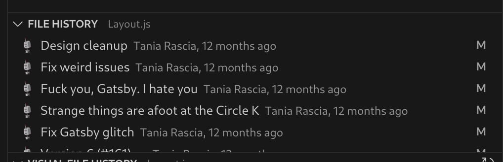

<h1 align="center">
  This is Matteo learning Gatsby
</h1>

The goal of this repository is to led me to something I can call my personal website.

Along the path, I would like to study something new and build something from scracth. What better way to do so rather then building it while documenting what I'm doing?

Skills I want to improve by doing so
- CSS, CSS Modules, maybe some styling library
- Modern react
- Gatbsy and its platform
- Markdown writing
- Graphql
- Tooling and IDE

What I would like to see on my website
- Nice presentation of myself
- Something I can export as my CV
- A list of projects I worked on
- Some articles about technologies and learning

I need to set my expectations correctly. Whenever I'm too ambitious, I always end up spending more time on configuration than the actual project. Actually, the main factor on the success of something I'm working on are not my ambitions but the time I put in.

## Day 1 🚀 The beginnings

1.  **Initialization of the project**

    So far everything looks good! I am following the [Tutorial](https://www.gatsbyjs.com/docs/tutorial/getting-started/part-1/) that should help me get up and running with Gatsby.

    The initialization is something like this.

      ```shell
    # create a new Gatsby site using the minimal TypeScript starter
    npm install -g gatsby
    ```

    ```shell
    # create a new Gatsby site using the minimal TypeScript starter
    npm init gatsby -- -ts
    ```

    And of course, to start the website in development mode


    ```shell
    cd my-gatsby-site/
    npm run develop
    ```

    *First issue encountered!* I cannot use Node 20. I need to use Node 18. It's ok, they say at least 18.


    A lot of things are done by yourself, like the first commit of the repository. I wanted to create a repository on the parent folder, but I guess if I want to keep the deployment simple I better stay with this.

    The only thing I'm not sure so far, is how can I have a .tsx file and typing correctly the props. So I temporarely converted the pages into .js and it seems to stop complaining.


2.  **Plugins**

    Now it's start to deep dive into the plugins. The ecosystems seem huge and even the smaller task can be delegated to a plugin. But I understand the concept. On a web increasingly complex, even the task of render a picture can be dependent on so many factors that is better to hide behind a nice abstraction.

    ```shell
    npm install gatsby-plugin-image gatsby-plugin-sharp gatsby-source-filesystem
    ```

    3 new dependencies just to display a picture? I love it!

3.  **GraphQL**

    This is something I was curious about. How Gatsby is going to use GraphQL?

    First of all, when developing a website, it provides a great interface at 

    ```http://localhost:8000/___graphql```


    Looks like everything can be queried, from the site metadata to the structure itself.

    ```graphql
    query MyQuery {
      site {
        siteMetadata {
          title
        }
      }
    }
    ```

  Accessing data is used by the method ```useStaticQuery```. This is cool, because it shows how all this queries are executed at build time and served statically.

  I bet there is a method to do dynamic queries as well.


4.  **SEO Compoonent**

    The tutorial wants me to create a SEO component that queries the metadata and use it as default when a title is not provided as prop.

    This is interesting. This component is then used into Head component.

    I can also hide the useStaticQuery behind a custom react hooks.

    So instead oif having something like

    ```
     const data = useStaticQuery(graphql`
      query {
        site {
          siteMetadata {
            title
          }
        }
      }
    `)

    ```

    We can refactor into:

    ```
    const useSiteMetadata = () => {
      const data = useStaticQuery(graphql`
        query {
          site {
            siteMetadata {
              title
            }
          }
        }
      `)

      return data.site.siteMetadata
    }

    ```


5.  **MDX Support**

    Looks very cool!

    ```shell
    npm install gatsby-plugin-mdx @mdx-js/react
    ```

    Interestingly, @mdx-js/react maps the implementation of the plugin into reacts component. I wonder why this cannot be a dependency of the plugin, since we are dealing with react in any case.

    The remark itself, can use plugins to enanche its features, like code coloring, ecc.

    A plugin makes available to GrapQL new data that can be queried! And I must admit that the graph explorer is quite cool to work with.

  
6.  **Page routing**

    Dynamic pages to route dynamic data. Looks similar to what NextJS does.

    Looks like that whener we enter into a page, a pageContext is populated

    ```js
    Object {
      // ...
      pageContext: Object {
        id: "11b3a825-30c5-551d-a713-dd748e7d554a"
        frontmatter__slug: "my-first-post"
      }
      // ...
    }
    ```

  And the exported object query is the ones that can use these info to query the data it needs to use.


7.  **Gatsby picture**
    Looks like that Gatsby allow to an even more dinamic version of the picture element. Not only we want to be dynamic on the loading of the picture, but also dynamic on how the picture is managed.

    Of course a new plugin is needed but they don't scare me anymore.

    ```shell
    npm install gatsby-transformer-sharp
    ```

    This allow to import what we have on the mdx data into our page.
  


## Day 2 🔭 Further explorations

1.  **Having multiples, separate blogs?**

    Yes, it's feasable, on a side we can have multible folders configured into the gatsby-plugins folder

    ```ts
    {
      resolve: `gatsby-source-filesystem`,
      options: {
        name: `blog`,
        path: `${__dirname}/blog/`,
      },
    }
    ```

    The issue is that we still need to filter the mdx values into the query, because they are all made available to graphql under the same "collection"

    ```graphql
     query {
      allMdx(
        filter: { fileAbsolutePath: { regex: "/second-blog/" } }
        sort: { fields: [frontmatter___date], order: DESC }
      ) {
        nodes {
          frontmatter {
            date(formatString: "MMMM D, YYYY")
            title
            slug
          }
          id
          excerpt
        }
      }
    }
    ```

    This is not entirely bad, as I learned how I can filter stuff when dealing with mdx. Let's pretend I want to hide a blog post from the list, I can add a field in the markdown and filter based on that.

1.  **Theming, dark mode and light mode?**

    Implementing a dark mode was not so difficult after all.

    First of all, I needed to implement a theme on the css at all!

    So, how css can be implemented?

    By importing it on the components we are working on!

    ```
    // Import from a CSS file in your src
    import "../styles/index.css"
    // Import from an installed package
    import "bootstrap/dist/css/bootstrap.min.css"

    ```

    Setting the dark theme is not something absolutely impossible. A lot pass through the layout file, that imports the style and can also override some styles with the dark theme.

    ```
      {theme === "dark" && (
        <link rel="stylesheet" type="text/css" href="/dark-mode.css" />
      )}
    ```

    The variable ```theme``` can be changed as every other state variable in react.

    And just like this you get an amazing dark mode on request! Hurray! But, there is a problem

    If you do so, every time you change page you get a white flash while in dark mode.

    The issue is that Layout, used as wrapper element for every page component, is not wrapper enaugh and get reloaded.

    The solution to fix this is twofold:

    1 - add a gatsby-browser file like this
      ```
      const React = require('react')

      export function wrapPageElement({ element, props }) {
        const Layout = element.type.Layout ?? React.Fragment

        return <Layout {...props}>{element}</Layout>
      }

      ```
    2 - add a similar line on every page

    ```IndexPage.Layout = Layout;```

    And of course, this is under documented and it's not clear at all. The page has a 'Layout' field ready to be set, but nobody told you so.

    How I found out this? Thanks to my inspiration for this project, the website of [https://taniarascia.com](taniarascia.com)

    

## DAY 3 🚧  Simple issues, big headaches

Every time I commit, a new build is performed and my website is updated. This is cool, of course. But you know the uncanney valley effect? In my extended interpretation, a small issue on an almost perfect website RUIN COMPLETELY THE EXPERIENCE. And in my case, this issue was the fact that the CSS was applied 100ms after the page was loaded. I guess this is a problem for everyone suffering from epilessy, but it is a huge problem for me as well.

'About the impostore syndrome'
Usually I tend to overthink the amount of obstacles I encounter everytime I fight a new issue. Whenever I working with a technology I'm confortable about, I'm a rocket. In no time I can find a solution to most of the issue or I can tell you whether a solution exists or not. 
When dealing with a new technology, I often look amazed to other people's results. 

When developing this website, I've had a couple of inspirations I looked at. Calling some of them inspiration is reductive, since I've "adopted" a lot of the solution these people are using and adapted their code as well.

As I mentioned before you can see a lot of similarities with [https://taniarascia.com](taniarascia.com). 

Why I'm talking about impostore syndrome? 
Because it took me zero seconds to identify what the problem was about, I've used the right tools to assess the issue (lighthouse), I've used the right script to reproduce the issue not only on the remote deployment but on a local deployment as well. 
I identified the solution quite quickly, implemented it even quickier. By the way, the solution is the usual underdocumented file that Tania used as well on her website. 
Still, the feeling I got when dealing with this was not great. I felt I was blocked trying to solve something that I should alrady have known instead of learning something actually usefull. It didn't matter the speed I fixed this issue (it would have took me days some years ago) or the fact that the documentation for this specific matter was rather poor.
I must admit though, writing it down helped me visualize how silly I am during these moments. There is another thing it helped a lot:



This made my day :)

**On setting up the projects page**

I've created a project page with mdx files.

The idea is that I can showcase the project I'll be working on and, if I want, I can write some story about the project itself.
I realized how little I shared so far of what I've been doing.  

I am also getting more confortable with GraphQL queries within Gatsby. I would like to see how well it behaves on more complex use cases.


    TODO NEXT:
    - Investigate on how styling works
    - Add new content and a nice navigation
    - Fix first margin on navigation
    - Refactor a footer adding a linkedin link 
    - 


## 🚀 Sparse notes

I don't have any at the moment :) Thank you for stopping by