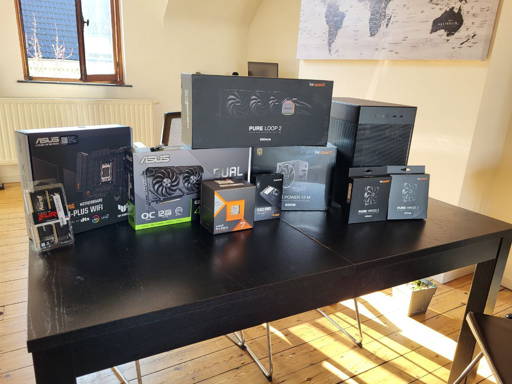

After 3 years of honored service, I think the time has come to let my Dell XPS 15 to retire and build a new machine for all my needs. 

I was 15 the time I build my last Desktop PC and surely things have changed a lot during all these years. Laptop computer served me well, but I never managed to get into activities that unfortunately are still not ideal on a portable machine.

Connecting several devices with an USB hub is still very unstable, and the power limitation of a battery powered device are evident whenever I needed to do more complex than usual. So, thanks to a new remote-working area I took the opportunity to learn and search components for my perfect build.

6 months and a ligther wallet later, here I am with a very nice machine that I would like to use for the years to come.

## The hardware

- Asus TUF GAMING B650M-PLUS WIFI
- AMD Ryzen 7 7800X3D 4.2 GHz 8-Core Processor
- Asus GeForce RTX 4070 SUPER DUAL-RTX
- Kingston DDR5 Fury Beast 2x16GB 6000
- Asus Prime AP201 Black
- Samsung 980 1TB M.2 SSD
- Samsung 990 PRO 1TB M.2 SSD

Of course the major investment has been the video card. The overall system is supposed to be quite powerfull since the beginning but also expandable in the future.
I've opted for an AIO liquid cooling solution and I must say, overall the system is incredibly silent when used under normal load. More time than not is even quiter than my XPS 15.

The build went smooth. Updating the BIOS was quite straitghforward, even if I was quite surprised to learn that the DDR5 platform is quite unstable and it just got better after new bios updates.
For instace, the initial boot time of this machine was longer than 30 seconds just to enter into the BIOS. Why so? 
It turns out that there are memory checks to perform before booting and these will take longer the more ram is installed. It was both fun and frustrating! I really brought me memories of PCs in the 90s that were doing memory check before booting. Lucky me, even with optimization turned on, there is a flag to speed up these tests and so far my system is running without any instability.
The BIOS settings to look for is named "Memory Context Restore". On Reddit there's plenty of people discussing this.

## The OS

Here's the part I really wanted to write about. It's been more 10 years since I've ditched Windows 8 in favour of Linux. I still remember the day I've installed Ubuntu on my personal laptop, followed some months later by Manjaro and by many many years of Fedora. 
I love Linux and I've loved using Linux for all these years. Everything that looked slow and unoptimized under Windows magically turned fast the day I moved to Linux. Startup times, snappiness of software and ease of development. Compared to Windows 8 that was really another planet. In that period I've also discovered how for me, coding felt like gaming, so I really didn't care about the lack of video card drivers support for my machines.
Year after year tought, I've got frustrated over some use-cases and I've realized how not everything about Linux made sense. I know drivers on Windows can sometimes be source of troubles, but compared to having ALL the drivers installed on the kernel it works way way way better. I still don't understand why some people still consider this a positive point. Every time I needed to interact with a new device or I had some special use case (virtual monitors, webcams, microphones and more) the Linux experience was simply not enjoyable. 

I was quite scared to use Windows as my daily OS, but I must admit that I've felt the same way I first moved to Linux 10 years ago. And I like it. Of course it's not a perfect experience but I am very pleased by the fact that I simply can enjoy some OS objectively and being capable to migrate my workflow without big traumas any time I will want. And while I now have a great desktop PC, I still need to use laptops on a lot of circumstances so I will continue to enjoy the power of Linux on my portable devices. 

Without any particular order, I'll try to share some points and thoughts on my experience so far, divived in Good, Ok, Bad. Some of these points are not about Windows, but it should be easy enaugh to understand which one. Please don't take them personally. 

### The GOOD
- [Chocolatey](https://chocolatey.org/) works amazingly well. This was the first thing I was scared about using Windows. I love Linux's package managers and Chocholatey surprised me for variety of supported software and how easy to use it is.
- The PC is incredibly fast. I had a powerfull laptop, but mobile components constrained by 150W of power consuption are really a bottleneck whenever I was asking it demanding activities.
- Windows solved many of the issue it had 10 years ago and it can offer a good developer experience with minimal tweaking. Maybe I need to thank Nadella for this, but I still remember how it was difficult to enter on ADB on Android devices compared to now.
- WLS is a game changer. I can keep most of my Linux workflows wihtout even noticing I'm on Windows sometimes. Docker feels the same and it's very nicely integrated, VS Code terminal runs on Linux and I've got nothing to regret. Using git, package managers and more is truly amazing.
- The hardware support is great. I am using Droidcam in order to use my old phone as webcam. On Linux, configuring it was a pain and required me to load custom kernel modules (and it was a pain to change the config). On Windows it took me 30 seconds to have the same configuration it took me 3 hours to figure out. I also discovered that my microphone doens't have volume issues, it was just Linux that had trouble with it. Furthermore, having a virtual external display is very easy. Doing the same thing on Linux it's feasable, but you must have an in-depth knowledge I was not able to get in 10 years of usage. And I tried, I swear!
- The software is overall polished. Postman, Discord, Slack, Teams, the list can be very long. Progressive web apps allowed me to use most of them on Linux as well, but having a good desktop support it's nice. 

### The OK
- Dualboot is easier than before, but still not perfect. Installing Windows proved easier than I expected, but having two OS in the same PC (work and leasure) still requires some tweaking. Whenever I want to boot on the secondary OS, the PC needs to be rebooted. I miss GRUB.
- Window management in ok, but Gnome Shell is way nicer to use. It's not even a feeeling. I can make calculations on the search bar, I can navigate more easily between apps and it's easier to move apps between workspaces. Maybe I will improve by time, but still!
- A lot of operations feels like magic. Installing the operating system, updating it and other stuff just works fine, but I would like to have more control over what my PC is doing.

### The BAD
- Bloatware bloatware bloatware. It takes a lot of time to opt-out from Microsoft tracking, spyware and all the apps that automatically install. Every single software tries to sell you something, and it cares about sending you notification you don't really need. I disabled any online search feature and I don't miss it, but it took time.
- Why on earth Edge thinks I need games, games and more games whenever I'm logged with my work account? It knows I'm on my work account because it's Microsoft account, but still it thinks that our productivity could be improved by showing games whenver it can. I still need to understand how to disable it.
- So many operations on my machine requires a reboot. 

### The ???
- I don't have a laptop anymore, so I needed to learn how I can fully use my AnniePro 2 keyboard without going to my laptop keyboard any time I didn't know how to press a key. Now that I learned it, I am way faster on typing and using additional keys on it. I like it!

## Final thoughts
I probably update the list above as soon as I find new features or get frustrated by other ones. Overall I must admit that the OS change was less traumatic than I was expecting and this is a positive things, regardless of my opinion about a closed system like Windows.
Still, I believe that a company should not have total control over our computers. I will happily use Windows for the foreseenable future, but I will keep to check how the Linux ecosystem is doing and will try any time I can to find out if the things I'm liking about Windows are improved or not on Linux.
I believe that, some years from now, I will move again my daily OS to Linux again and I can't wait to feel again the same way I feel every time I make the switch. 
Hopefully my personal space will still be alive and I will write another post about it.

PS: This is my second time writing this post. The first time I did it, I deleted I file that appeared on my the post's folder that, somehow deleted this post as well. Not sure if it was because of WSL or some error I've made. This is a nice remainder that we should never be too nice about Windows, never :)